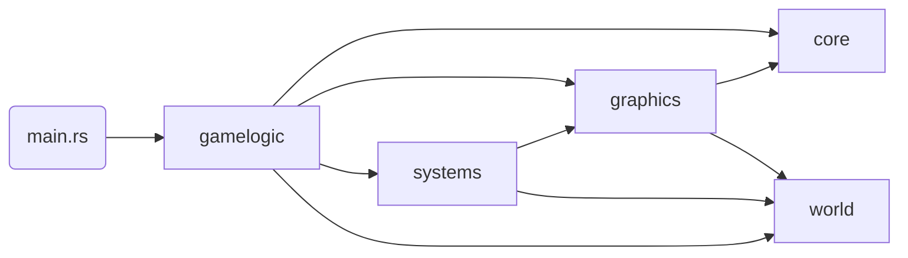

# voxel-rs

-- TODO table of contents

This project is a rendering engine for displaying interactive, infinite voxel terrains at interactive frame rates.
Instead of using a traditional rasterization approach, the engine relies on a Sparse Voxel Octree (SVO) as its
acceleration structure for raytracing voxels instead. The implementation is a derivative work of 
[Samuli Laine and Tero Karras. 2010 "Efficient sparse voxel octrees"](https://research.nvidia.com/sites/default/files/pubs/2010-02_Efficient-Sparse-Voxel/laine2010i3d_paper.pdf).

In addition to rendering, the engine supports basic interactivity and physics to enable the player to walk through
the randomly generated world.

Rust and OpenGL were chosen for their high performance, memory safety and ease of use. Since most of the rendering work
is done in shaders, usage of the actual OpenGL API is minimal.

## Motivation

Most games use rasterization to render geometry to the screen, because it is the most versatile and computationally
cheap approach to display arbitrary 3D objects. Models are triangulated, potentially compressed into lower Levels of
Detail (LOD) to reduce triangle count, and loaded into GPU buffers to be later rasterized and drawn. Because of its many
use-cases, hardware manufactures have optimized for triangle workloads, and it became the de facto standard for
interactive rendering.

Raytracing on the other hand was always computationally expensive and difficult to impossible to perform in real-time.
Recent advances have made it possible to use triangular geometry as an acceleration structure to perform raytracing
in on top of a rasterized scene (e.g. Nvidia RTX). Even though, casting at least one ray per screen pixel is costly for
high triangle count games.

As a result, voxel games (e.g. Mincecraft, Terrasology, MineTest, CubeWorld) render their worlds by breaking it up into
smaller chunks and constructing a triangle mesh per chunk. Choosing the right chunk size is important, as it impacts
the cost of regenerating a mesh upon change, the efficiency of managing those chunks in memory (loading / storing /
generating / etc.), and especially the overall frame time as the engine tries to figure out which meshes to draw per
frame and how much of a chunk mesh is outside the viewport.

Constructing meshes using a greedy meshing (TODO reference) implementation is both quick and results in low triangle
count in common scenarios, while having drawbacks such as visual artifacts (e.g. "holes") along shared edges.
Additionally, depending on the properties of the voxel world, it might have caves or other structures in it, that 
are only visible when the camera is within the chunk. Since a mesh cannot be partially drawn, overdraw can happen
that leads to meshes being rendered that might not be visible. This is fixable by implementing flood-fill algorithms
or other detection approaches (TODO reference minecraft post), but comes at the cost of higher frame times.

Depending on the size of the voxel world, some concept of LoD and hierarchical lookup structure is necessary to speed
up the frustum culling / visibility calculation to determine the set of meshes to draw. This usually has the shape of
an Octree.

In short, there are a few disadvantages when using triangle meshes for voxel rendering. Hence, the motivation for this
project is to use the idea of Octrees and the nature of voxels being axis-aligned cubes to find an efficient raytracing
implementation that scales better for large, infinite voxel worlds than rasterization.

## Requirements

The goal of this project is to display infinite, randomly generated voxel worlds to the player and allow them to
interact with them at interactive frame rates (~60-120 FPS). To avoid many of the implementation problems described
above, a Sparse Voxel Octree is used to cast rays against. The structure is efficient for skipping large parts of the
scene that contain no voxels, while still allowing "infinite" level of detail where it is required.

To keep players engaged, the performance should remain stable while the world is generated as the player moves. In
addition, to be comparable to other voxel games, the renderer must implement basic lighting, cast simple shadows,
and map textures and normal maps.

## Architecture

At a high level, the main function instantiates a new `Game` instance and enter the game loop, which runs until the
window is closed. During setup, the game sets up a couple game logic components, which themselves initialize the game
`systems`.

### Module Structure

The high level dependency chain looks as follows:
`world <- systems|graphics <- gamelogic`

Each module in the chain builds on top of the previous one and extends it or combines concepts. `world` contains
all the base data structures and algorithm to manage chunks, construct octrees and serialize them into SVOs.
`systems` use those primitives to build abstract, higher-order systems such world generators, chunk loaders, SVO to
GPU buffer mappers, etc. Finally, `gamelogic` adds the glue code and implementation of abstract systems to combine them
into an interactive application.

`graphics` and `core` provide reusable structs and functions to interact with the OS, the rendering context, and OpenGL
in general.

### Runtime

To make rendering a voxel world possible, several systems and data structures have to work in close coordination. The
main part of this choreography is performed in `gamelogic::world`. All logic is dependent on the player's position in
the world and a configured loading radius of chunks around that position. The player is controlled by
`gamelogic::gampplay`. At a conceptual level, the following happens on every frame:

1. Given the current player position & loading radius, the chunk loader system figures out if the player
has moved and entered a new chunk. If yes, it produces events to load/unload and update LoDs of loaded chunks.
2. Newly loaded chunks, are enqueued on the world generator, if they cannot be loaded from storage, and added to the
world chunk map after generation.
3. Unloaded chunks are removed from the world, and changed LoDs are updated in the map.
4. For every chunk change (e.g. voxel was edited), LoD adjustment, or newly generated chunk, the chunk is added to the
SVO system, to be serialized and updated in the GPU buffer.

This event driven approach allows moving expensive calculations to background threads. A shared Job System is used for
this that is passed into every gamelogic component and system to allow sharing all available machine threads. Urgent
tasks can be prioritized over normal tasks during enqueuing. Additionally, the job system allows for cancelling queued
jobs.

One special feature that is used by the world implementation is "Chunk Borrowing", which allows a caller to claim
ownership of a world chunk and later return it. This is used for efficiently passing a chunk's Octree storage around
without having to implement synchronization primitives. In general, all components are designed to be run on one thread.
Jobs are created to perform the work, but the main thread joins all results together.

### Octree

- octree data structure
  - implementation details and runtime complexity
  - optimization decisions (e.g. z-ordering inserts)

### SVO

- svo data structure
  - data layout
  - advantages of pointers
  - empty space & reuse (ring buffer)
  - space efficiency compared to flat arrays or other structures
  - infinite octrees - how does shifting/rotation work?

### Raytracer

- svo raytracer
  - explain actual implementation (and give reference to original papers)
  - runtime complexity
  - using ssbo in persistent, coherent mapping
  - why is the algo a good choice and what makes it fast?
  - "prove" constant runtime on different screen resolutions
  - used by physics in compute shader

### World Generator

World generation is inspired by Minecraft (TODO youtube video link). There are no biomes or climates in this
implementation. All chunks are generated using two layers of perlin noises with several octaves each:
one for _continentalness_ (i.e. how far in the inland a point is), and _erosion_ (i.e. how mountainous a point is).

To make the terrain visually appealing, spline point curves are used to map the linear -1..1 noise value to actual
terrain height values.

## Development

### Testing

The project has many tests in place and uses `clippy` to ensure style consistency. Every commit triggers a CI pipeline.

Most code is covered by unit tests. In addition to that, there are:

- End-to-end tests, that render the full scene to ensure that all components interact properly with one another
- Graphical tests, that test shaders or other graphical systems and assert their result by comparing them against an
expected image
- A suite of special shader test that use a GPU buffer to write debug information to, which can then be asserted to
ensure that the raytracer works according to its design

### Build Features

The following custom cargo build features can be used, when compiling the project:

- `dhat-heap` (use with `release-dhat` profile): enables heap allocation profiling
  - look at `make heap-profile`
- `bundle-assets`: if enabled, `build.rs` copies all asset contents into the final binary to allow distribution without
any additional dependencies

### Future Tasks

- Right now, there is no Storage Layer implementation. That means that the world is regenerated on every program
execution. Writing the world data in an efficient representation to flash storage, could allow for speeding up load
times.

- Large loading radii suffer become increasingly slower as SVO memory management becomes more complex. Instead of
requiring all memory operations to be performed in the main thread in a coordinated way, there could be alternative
implementation that reduce this to a minimum and allow for streaming data in from other threads.

- While the raytracer performs well on high screen resolutions, it struggles with large worlds on 4k monitors. One way
of optimizing this is to try to reduce the steps a ray has to make through empty space before it hits anything. The
original paper describes this as "Thick Rays". A pre-pass can try to determine the actual depth of intersection for a
group of pixel at once to then allow those pixels to start much further into the scene.
