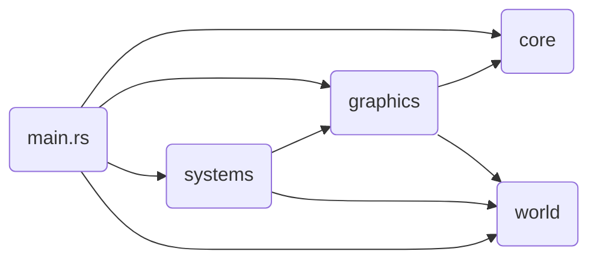
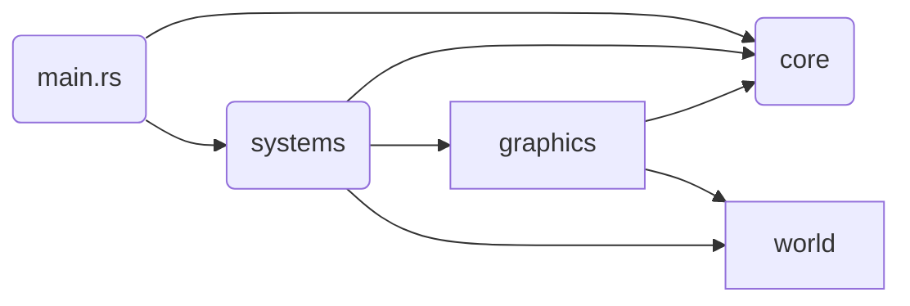

# voxel-rs

## Package Overview

### Currently

```mermaid
flowchart LR
    main(main.rs) --> core(core)
    main --> graphics(graphics)
    main --> systems(systems)
    main --> world(world)

    graphics --> core

    graphics --> world

    systems --> graphics
    systems --> world
```

### Plan

```mermaid
flowchart LR
    main(main.rs) --> core(core)
    main --> systems(systems)
    
    graphics --> core
    
    graphics --> world
    
    systems --> core
    systems --> graphics
    systems --> world
```
