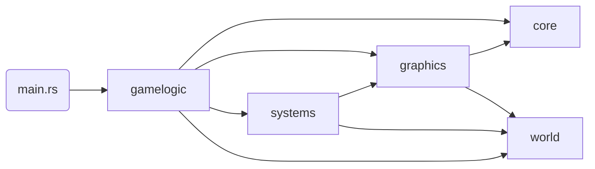

# voxel-rs

This project is a rendering engine for displaying interactive, infinite voxel terrains at interactive frame rates.
Instead of using a traditional rasterization approach, the program relies on a Sparse Voxel Octree (SVO) as its
acceleration structure for raytracing voxels. The implementation is a derivative work of
[Samuli Laine and Tero Karras. 2010 "Efficient sparse voxel octrees"](https://research.nvidia.com/sites/default/files/pubs/2010-02_Efficient-Sparse-Voxel/laine2010i3d_paper.pdf).

In addition to rendering, the engine supports basic interactivity and physics to enable the player to walk through
the randomly generated world.

Rust and OpenGL were chosen for their high performance, memory safety, and ease of use. Since most of the rendering work
is done in shaders, usage of the actual OpenGL API is minimal.

## Motivation

Most games use rasterization to render geometry to the screen because it is the most versatile and computationally
cheap approach to display arbitrary 3D objects. Models are triangulated, potentially compressed into lower Levels of
Detail (LOD) to reduce triangle count, and loaded into GPU buffers to be later rasterized and drawn. Because of its many
use cases, hardware manufacturers have optimized for triangle workloads, and it became the de facto standard for
interactive rendering.

Raytracing, on the other hand, was always computationally expensive and challenging to perform in real-time.
Recent advances have made it possible to use triangular geometry as an acceleration structure to perform raytracing
on top of a rasterized scene (e.g., Nvidia RTX). Even though casting at least one ray per screen pixel is costly for
high triangle count games.

As a result, voxel games (e.g., Minecraft, Terasology, MineTest, CubeWorld) render their worlds by breaking them up into
smaller chunks and constructing a triangle mesh per chunk. Choosing the right chunk size is essential, as it impacts
the cost of regenerating a mesh upon change, the efficiency of managing those chunks in memory (loading/storing/generating),
and especially the overall frame time as the engine tries to figure out which meshes to draw per frame.

By default, each voxel has two triangles per face, yielding 12 triangles in total. Without optimization, a typical voxel
world would have too many triangles to be rendered efficiently. Fixing this means implementing a greedy meshing algorithm
(good writeup [here](https://0fps.net/2012/06/30/meshing-in-a-minecraft-game/))
for combining adjacent faces, with drawbacks such as visual artifacts (e.g., "holes") along shared edges.

However, even with optimized meshes, it is challenging to prevent overdraw, where multiple chunk meshes are drawn on top
of each other, although only a subset is visible. This problem is fixable by implementing flood-fill algorithms
or other detection approaches ([Minecraft's Implementation](https://tomcc.github.io/2014/08/31/visibility-1.html)),
which comes at the cost of higher frame times.

Depending on the size of the voxel world, some version of LoD and hierarchical lookup structure is necessary to speed
up the frustum culling/visibility calculation to determine the set of meshes to draw. Usually, this has the shape of
an Octree.

In short, there are a few disadvantages when using triangle meshes for voxel rendering. Hence, the motivation for this
project is to use the idea of Octrees and the nature of voxels being axis-aligned cubes to find an efficient raytracing
implementation that scales better for large, infinite voxel worlds than rasterization.

## Requirements

This project aims to display infinite, randomly generated voxel worlds to the player and allow the latter to
interact with them at interactive frame rates (~60-120 FPS). In order to avoid many of the implementation problems described
above, a Sparse Voxel Octree is used to cast rays against. The structure is efficient for skipping large parts of the
scene that contain no voxels while allowing an "infinite" level of detail where needed.

In order to keep players engaged, the performance should remain stable while the world is generated as the player moves. In
addition, to be comparable to other voxel games, the renderer must implement basic lighting, cast simple shadows,
and map textures and normal maps.

## Architecture

At a high level, the main function creates a new `Game` instance and enters the game loop until the
window is closed. During setup, the game sets up a couple of game logic components, which initialize the game
`systems`.

### Module Structure

The abstract dependency chain looks as follows:
`world <- systems|graphics <- gamelogic`

Each module in the chain builds on top of the previous one and extends it or combines its concepts. `world` contains
all the base data structures and algorithms to manage chunks, construct octrees, and serialize them into SVOs.
`systems` use those primitives to build abstract, higher-order systems such as world generators, chunk loaders, SVO to
GPU buffer mappers, etc. Finally, `gamelogic` adds the glue code and implementation of abstract systems to combine them
into an interactive application.

`graphics` and `core` provide reusable structs and functions to interact with the OS, the rendering context, and OpenGL
in general.

### Runtime

Several systems and data structures must work closely together to render a voxel world. The
central part of this choreography is performed in `gamelogic::world`. All logic depends on the player's position in
the world and a configured loading radius of chunks around that position. The player is controlled by
`gamelogic::gameplay`. At a conceptual level, the following happens on every frame:

1. Given the current player position and loading radius, the chunk loader system recognizes if the player
   has moved and entered a new chunk. If yes, it produces events to load/unload chunks and update LoDs of loaded chunks.
2. Newly loaded chunks are enqueued on the world generator if not loaded from storage and added to the
   world chunk map after generation.
3. Unloaded chunks are removed from the world, and changed LoDs are updated in the map.
4. Every chunk change (e.g., a voxel was edited), LoD adjustment, or newly generated chunk is added to the SVO system to
   be serialized and updated in the GPU buffer.

This event-driven approach allows expensive calculations to be moved to background threads. A shared job system is used for
this and passed into every gamelogic component and system to allow sharing of all available machine threads. Urgent
tasks can be prioritized over regular tasks during enqueuing. Additionally, the job system allows for canceling queued
jobs.

One unique feature of the world implementation is "Chunk Borrowing", which allows a caller to claim ownership of a world
chunk and later return it. This mechanism efficiently passes a chunk's Octree storage around without the need for
synchronization primitives. In general, all components are designed to be run on one thread.
Jobs are created to perform the work, but the main thread joins all results.

### Octree

All chunks store their voxel content as octrees, allowing for efficient SVO construction and compression of
space compared to a flat array. The main downside is that reading or writing along the x, y, and z axes produces overhead
to find the leaf nodes.

An Octree is stored as an array of Octants and a pointer to the root Octant. A fixed-size array of 8 children defines
each Octant, where each element can be either empty, a child octant, or a leaf node. Additionally, octants keep a pointer
to their parent octant to allow bidirectional traversal.

Pointers are the Octant's position inside the Octree's octant array. Removing an octant does not remove the array
element but adds it to a free list, allowing it to be reused later. The main reason for using pointers instead of moving
values in memory is that whole sub-octrees can be moved inside the parent octree at the same cost as moving single leaf
values.

All read/write operations recursively descend and optionally extend the Octree until they reach the required depth.
Hence, the runtime complexity is `O(log N)`.

Filling a chunk with data commonly involves iterating across all axes (e.g., `for x, y, z in (32,32,32)`) to determine
which voxel needs to be set at a given position. By default, this has the complexity of `O(N * log N)`. A more efficient
implementation with `O(log N)` is provided as an iterator constructor. It iterates in z-ordering at the leaf level first
and ascends through the Octree, combining children into new octants until an octree is formed. Since it constructs the
Octree bottom-up, the result contains no empty branches.

### SVO

The Sparse Voxel Octree implementation is similar to the Octree one described above. It uses a linear memory buffer
to encode octants and their children using bitmasks and pointers. As opposed to the Octree, it does not store parent
pointers and other data helpful in traversing and modifying the structure, as it is predominantly used for read-only
operations. Pointers can be defined as relative and absolute pointers, allowing for efficient encoding of nested octree
structures while maintaining the option to move larger subtrees by swapping pointers.

SVOs keep a list of empty buffer regions for reuse to behave similarly to a ring buffer. Since empty octants take up almost
no space (at most 5 bytes), Sparse Octrees are more space efficient than linear arrays.

### Octree Shifting

The final world is stored as an octree of octrees, where every chunk is one Octree encoded using relative pointers in
a larger world octree using absolute pointers to each chunk octree. This allows for independently serializing each chunk
as an SVO and copying them to the final SVO buffer without impacting the actual SVO renderer.

Swapping pointers (see SVO above) can be used to achieve the feeling of an "infinite" world. In addition to the absolute player position in
the world, an additional position at the center of the Octree is calculated. Whenever the player leaves the center-most
octant (along any axes), the relative position is reset to the new center octant, and all chunk octants
are shifted one position into the opposite direction of the player movement. This way, chunks are rotated
through the Octree, making space for new chunks to be loaded. This operation grows linearly with the number of chunks
in the world.

### Raytracer

The description here is a high-level overview of the raytracer implementation. An in-depth version can be found in the [Shader](assets/shaders/svo.glsl).

At its core, the algorithm traverses the SVO data structure described above. Upon calculating the intersection octant,
using precomputed ray direction coefficients for ray-plane intersections (one plane per axis), it uses the current SVO
octant pointer to resolve children and leaf bitmasks to decide whether nothing, another octant, or a leaf was hit.

If nothing was hit, it steps through the Octant and continues. If an octant boundary is crossed while stepping, it
ascends to the topmost parent octant to be iterated next. If a leaf is hit, it calculates the intersection point,
normals, uvs, etc. In the case of an octant, it descends into the Octant and repeats from the top.

This results in a worst-case complexity of `O(4 ^ (log N))`, if every possible Octant inside an octree contains only
one leaf, which would cause the algorithm to visit at most four child octants per Octant without hitting anything. In
regular voxel worlds, this scenario is improbable since either several higher-level octants are skipped at once or a leaf
is found quickly.

Given the algorithm's nature, it is a good fit for sparse voxel worlds as it efficiently skips through space
without wasting cycles on unnecessary ascents / descends. The most noteworthy part is the ascend implementation, which
can skip multiple parents at once.

At runtime, the SVO buffer is mapped as a persistent, coherent OpenGL buffer to avoid inefficient BIND draw calls. This
has the downside of using immutable storage, which makes resizing the buffer impossible without creating a new one and
copying all the data. However, the ring-buffer approach reuses space, making it possible to choose a generous static
buffer size at allocation time to avoid copies.

In the actual renderer, a screen-sized quad invokes a fragment shader per screen pixel to render the world.
Additionally, a compute shader is used with the same algorithm to perform mouse ray-casts and basic collision
simulation.

### World Generator

World Generation is inspired by Minecraft ([Talk by Henrik Kniberg](https://www.youtube.com/watch?v=CSa5O6knuwI)).
There are no biomes or climates in this implementation. All chunks are generated using two layers of Perlin noises with
several octaves each: one for _continentalness_ (i.e., how far in the inland a point is), and _erosion_
(i.e., how mountainous a point is).

Spline point curves are used to make the terrain visually appealing. They map the linear -1..1 noise value to the actual
terrain height values.

## Development

### Testing

The project has many tests and uses `clippy` to ensure style consistency. Every commit triggers a CI pipeline.

Unit tests cover most code. In addition to that, there are:

- End-to-end tests that render the entire scene to ensure that all components interact correctly with one another
- Graphical tests that test shaders or other graphical systems and assert their result by comparing them against an
  expected image
- A suite of special shader tests that use a GPU buffer to write debug information to, which can then be asserted to
  ensure that the raytracer works according to its design

### Build Features

The following custom cargo build features can be used when compiling the project:

- `dhat-heap` (use with `release-dhat` profile): enables heap allocation profiling
    - look at `make heap-profile`
- `bundle-assets`: if enabled, `build.rs` copies all asset contents into the final binary to allow distribution without
  any additional dependencies

### Future Tasks

- Right now, there is no Storage Layer implementation. That means that the world is regenerated on every program
  execution. Storing the world data in an efficient representation on flash memory could speed up load times.

- Large loading radii become increasingly slower as SVO memory management becomes more complex. Instead of requiring all
  memory operations to be performed in the main thread in a coordinated way, there could be alternative
  implementations that reduce this to a minimum and allow streaming data from other threads.

- The raytracer performs well on high screen resolutions but struggles with large worlds on 4k monitors. Several ideas
  on how to make this more efficient exist:

  - Reduce the steps a ray must make through space before it hits anything. The original paper describes this as
    "Thick Rays". A pre-pass can try to determine the actual depth of intersection for a group of pixels at once to
    allow those pixels to start much further into the scene.

  - When casting secondary rays, the octree needs to descend to the starting position before casting the ray itself.
    At the end of the primary ray, the stack is already build, so it should be possible to reuse it to avoid doing 
    duplicate work.

  - When the camera is within the octree, the ray-tracer has to descend to the leaf level at the starting position first,
    in order to step through the tree. This calculation is the same for every pixel, so it might be possible to
    pre-calculate it to reduce unnecessary work.
