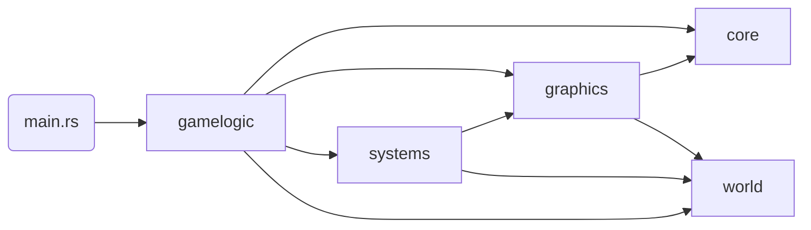

# voxel-rs

This project is a rendering engine for displaying interactive, infinite voxel terrains at interactive frame rates.
Instead of using a traditional rasterization approach, the engine relies on a Sparse Voxel Octree (SVO) as its
acceleration structure for raytracing voxels instead. The implementation is a derivative work of 
[Samuli Laine and Tero Karras. 2010 "Efficient sparse voxel octrees"](https://research.nvidia.com/sites/default/files/pubs/2010-02_Efficient-Sparse-Voxel/laine2010i3d_paper.pdf).

In addition to rendering, the engine supports basic interactivity and physics to enable the player to walk through
the randomly generated world.

Rust and OpenGL were chosen for their high performance, memory safety and ease of use. Since most of the rendering work
is done in shaders, usage of the actual OpenGL API is minimal.

## Motivation

Most games use rasterization to render geometry to the screen, because it is the most versatile and computationally
cheap approach to display arbitrary 3D objects. Models are triangulated, potentially compressed into lower Levels of
Detail (LOD) to reduce triangle count, and loaded into GPU buffers to be later rasterized and drawn. Because of its many
use-cases, hardware manufactures have optimized for triangle workloads, and it became the de facto standard for
interactive rendering.

Raytracing on the other hand was always computationally expensive and difficult to impossible to perform in real-time.
Recent advances have made it possible to use triangular geometry as an acceleration structure to perform raytracing
in on top of a rasterized scene (e.g. Nvidia RTX). Even though, casting at least one ray per screen pixel is costly for
high triangle count games.

As a result, voxel games (e.g. Mincecraft, Terasology, MineTest, CubeWorld) render their worlds by breaking it up into
smaller chunks and constructing a triangle mesh per chunk. Choosing the right chunk size is important, as it impacts
the cost of regenerating a mesh upon change, the efficiency of managing those chunks in memory (loading / storing /
generating / etc.), and especially the overall frame time as the engine tries to figure out which meshes to draw per
frame and how much of a chunk mesh is outside the viewport.

Constructing meshes using a greedy meshing (good writeup [here](https://0fps.net/2012/06/30/meshing-in-a-minecraft-game/))
implementation is both quick and results in low triangle
count in common scenarios, while having drawbacks such as visual artifacts (e.g. "holes") along shared edges.
Additionally, depending on the properties of the voxel world, it might have caves or other structures in it, that 
are only visible when the camera is within the chunk. Since a mesh cannot be partially drawn, overdraw can happen
that leads to meshes being rendered that might not be visible. This is fixable by implementing flood-fill algorithms
or other detection approaches ([Minecraft's Implementation](https://tomcc.github.io/2014/08/31/visibility-1.html)),
but comes at the cost of higher frame times.

Depending on the size of the voxel world, some concept of LoD and hierarchical lookup structure is necessary to speed
up the frustum culling / visibility calculation to determine the set of meshes to draw. This usually has the shape of
an Octree.

In short, there are a few disadvantages when using triangle meshes for voxel rendering. Hence, the motivation for this
project is to use the idea of Octrees and the nature of voxels being axis-aligned cubes to find an efficient raytracing
implementation that scales better for large, infinite voxel worlds than rasterization.

## Requirements

The goal of this project is to display infinite, randomly generated voxel worlds to the player and allow them to
interact with them at interactive frame rates (~60-120 FPS). To avoid many of the implementation problems described
above, a Sparse Voxel Octree is used to cast rays against. The structure is efficient for skipping large parts of the
scene that contain no voxels, while still allowing "infinite" level of detail where it is required.

To keep players engaged, the performance should remain stable while the world is generated as the player moves. In
addition, to be comparable to other voxel games, the renderer must implement basic lighting, cast simple shadows,
and map textures and normal maps.

## Architecture

At a high level, the main function instantiates a new `Game` instance and enter the game loop, which runs until the
window is closed. During setup, the game sets up a couple game logic components, which themselves initialize the game
`systems`.

### Module Structure

The high level dependency chain looks as follows:
`world <- systems|graphics <- gamelogic`

Each module in the chain builds on top of the previous one and extends it or combines concepts. `world` contains
all the base data structures and algorithm to manage chunks, construct octrees and serialize them into SVOs.
`systems` use those primitives to build abstract, higher-order systems such world generators, chunk loaders, SVO to
GPU buffer mappers, etc. Finally, `gamelogic` adds the glue code and implementation of abstract systems to combine them
into an interactive application.

`graphics` and `core` provide reusable structs and functions to interact with the OS, the rendering context, and OpenGL
in general.

### Runtime

To make rendering a voxel world possible, several systems and data structures have to work in close coordination. The
main part of this choreography is performed in `gamelogic::world`. All logic is dependent on the player's position in
the world and a configured loading radius of chunks around that position. The player is controlled by
`gamelogic::gampplay`. At a conceptual level, the following happens on every frame:

1. Given the current player position & loading radius, the chunk loader system figures out if the player
has moved and entered a new chunk. If yes, it produces events to load/unload and update LoDs of loaded chunks.
2. Newly loaded chunks, are enqueued on the world generator, if they cannot be loaded from storage, and added to the
world chunk map after generation.
3. Unloaded chunks are removed from the world, and changed LoDs are updated in the map.
4. For every chunk change (e.g. voxel was edited), LoD adjustment, or newly generated chunk, the chunk is added to the
SVO system, to be serialized and updated in the GPU buffer.

This event driven approach allows moving expensive calculations to background threads. A shared Job System is used for
this that is passed into every gamelogic component and system to allow sharing all available machine threads. Urgent
tasks can be prioritized over normal tasks during enqueuing. Additionally, the job system allows for cancelling queued
jobs.

One special feature that is used by the world implementation is "Chunk Borrowing", which allows a caller to claim
ownership of a world chunk and later return it. This is used for efficiently passing a chunk's Octree storage around
without having to implement synchronization primitives. In general, all components are designed to be run on one thread.
Jobs are created to perform the work, but the main thread joins all results together.

### Octree

All chunks store their voxel content as octrees. This allows for efficient SVO construction and compression of empty
space compared to a flat array. The main downside is that reading or writing along the x,y,z axes produces overhead
to find the actual leaf nodes.

An Octree is stored as an array of Octants and a pointer to the root Octant. Each Octant is defined by a fixed-size
array of 8 children, each either being empty, a child octant or a leaf node. Additionally, octants keep a pointer to
their parent octant to allow for bidirectional traversal.

Pointers are the octant's position inside the octree's octant array. Removing an octant does not remove the array
element but adds it to a free list instead to be reused later.

All read / write operations recursively descend and optionally extend the octree until they reach the required depth.
Hence, the runtime complexity is `O(log N)`.

The main reason for using pointers instead of actually moving values in memory is that whole sub-octrees can be moved
inside the parent octree at the same cost as moving single leaf values.

To mitigate the performance issue of writing axis-aligned voxel data (e.g. `for x, y, z in (32,32,32)`) into an octree,
the implementation supports a custom iterator constructor that iterates in z-ordering at the leaf level first and
ascends through the octree combining children into new octants until an octree is formed. This reduces the worst case
of `O(N * log N)` to `O(log N)`.

### SVO

The Sparse Voxel Octree implementation is similar to the Octree one described above. It uses a linear memory buffer
to encode octants and their children using bitmasks and pointers. As opposed to the Octree, it does not store parent
pointers and other data useful for traversing and modifying the structure, as it is predominantly used for read-only
operations. Pointers can be defined as relative and absolute pointers, allowing for encoding nested octree structures
cache-efficiently while maintaining the option to move larger subtrees by swapping pointers.

SVOs keep a list of empty buffer regions for reuse to act similar to a ring buffer. Since empty octants take up almost
no space (at most 5 bytes), Sparse Octrees are more space efficient than linear arrays.

### Octree Shifting

The final world is stored as an octree of octrees, where every chunk is one octree encoded using relative pointers in
a larger world octree using absolut pointers to each chunk octree. This allows for serializing each chunk as an SVO
independently and copying them to the final SVO buffer without impacting the actual SVO renderer. Only when the newly
serialized SVO pointer is actually set in the world SVO, will it be rendered.

To achieve an "infinite" world, swapping pointers can be used as well. In addition to the absolute player position in
the world, an additional position at the center of the octree is calculated. Whenever the player leaves the center-most
octant (across all axes) of the octree, the relative position is reset to the new center octant and all chunk octants
are shifted one position into the opposite direction of the player movement. This way, chunks are essentially rotated
through the octree making space for new chunks to be loaded in. This operation grows linearly with the number of chunks
in the world. 

### Raytracer

This is a high level overview of the raytracer implementation.
It is explained in-depth in the [GLSL Shader](assets/shaders/svo.glsl).

At its core, the algorithm traverses the SVO data structure described above. Upon calculating the intersection octant,
using precomputed ray direction coefficients for ray-plane intersections (one plane per axis), it uses the current SVO
octant pointer to resolve children & leaf bitmasks to decide whether a nothing, another octant or a leaf was hit.

If nothing was hit, it steps through the octant and continues. In case an octant boundary is crossed while stepping, it
ascends to the top most parent octant that is to be iterated next. If a leaf is hit, it calculates intersection point,
normals, uvs, etc. In case of an octant, it descends into the octant and repeats from the top.

This results in a worst-case complexity of `O(4 ^ (log N))`, if every possible octant inside an octree contains only
one leaf, which would cause the algorithm to visit at most 4 child octants per octant without hitting anything. In
normal voxel worlds, this scenario is very unlikely to occur.

The implementation uses a local stack of up to 23 entries, which also limits the maximum depth of the SVO. This is a
result of the many optimisations of the implementation relying on direct float32 bit manipulation of the mantissa, which
is encoded as 23bits for float32 IEEE.

Given the algorithm's nature, it is a good fit for sparse voxel worlds as it efficiently skips through empty space
without wasting cycles on unnecessary ascents / descends. The most noteworthy part is the ascend implementation, which
can skip multiple parents at once.

At runtime, the SVO buffer is mapped as a persistent, coherent OpenGL buffer to avoid inefficient BIND draw calls. This
has the downside of having to use immutable storage, which makes resizing the buffer difficult, but since the SVO data
is compressed and the ring-buffer approach reuses empty space, a static size can be chosen at allocation time.

In the actual renderer, a screen-sized quad is used to invoke a fragment shader per screen pixel to render the world.
Additionally, a compute shader is used with the same algorithm to perform mouse ray-casts and basic collision
simulation.

### World Generator

World generation is inspired by Minecraft ([Talk by Henrik Kniberg](https://www.youtube.com/watch?v=CSa5O6knuwI)).
There are no biomes or climates in this implementation. All chunks are generated using two layers of perlin noises with
several octaves each: one for _continentalness_ (i.e. how far in the inland a point is), and _erosion_
(i.e. how mountainous a point is).

To make the terrain visually appealing, spline point curves are used to map the linear -1..1 noise value to actual
terrain height values.

## Development

### Testing

The project has many tests in place and uses `clippy` to ensure style consistency. Every commit triggers a CI pipeline.

Most code is covered by unit tests. In addition to that, there are:

- End-to-end tests, that render the full scene to ensure that all components interact properly with one another
- Graphical tests, that test shaders or other graphical systems and assert their result by comparing them against an
expected image
- A suite of special shader test that use a GPU buffer to write debug information to, which can then be asserted to
ensure that the raytracer works according to its design

### Build Features

The following custom cargo build features can be used, when compiling the project:

- `dhat-heap` (use with `release-dhat` profile): enables heap allocation profiling
  - look at `make heap-profile`
- `bundle-assets`: if enabled, `build.rs` copies all asset contents into the final binary to allow distribution without
any additional dependencies

### Future Tasks

- Right now, there is no Storage Layer implementation. That means that the world is regenerated on every program
execution. Writing the world data in an efficient representation to flash storage, could allow for speeding up load
times.

- Large loading radii suffer become increasingly slower as SVO memory management becomes more complex. Instead of
requiring all memory operations to be performed in the main thread in a coordinated way, there could be alternative
implementation that reduce this to a minimum and allow for streaming data in from other threads.

- While the raytracer performs well on high screen resolutions, it struggles with large worlds on 4k monitors. One way
of optimizing this is to try to reduce the steps a ray has to make through empty space before it hits anything. The
original paper describes this as "Thick Rays". A pre-pass can try to determine the actual depth of intersection for a
group of pixel at once to then allow those pixels to start much further into the scene.
