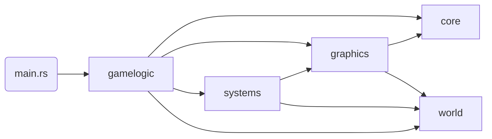

# voxel-rs

- Short description
  - voxel raytracer with infinite terrain generation
  - opengl & rust
  - raytracer in glsl
- Problems the project solves and its own goals
  - voxel engine rasterization issues
  - raytracing & accurate shadow issues
  - vast, modifiable landscapes
  - connect to real world requirements of game engines (requirement analysis)
  - etc
- Future tasks
  - Streaming optimization
  - Raytracing optimization
  - Storage layer

- Core technologies
  - octree data structure
    - implementation details and runtime complexity
    - optimization decisions (e.g. z-ordering inserts)
  - svo data structure
    - data layout
    - advantages of pointers
    - empty space & reuse (ring buffer)
    - space efficiency compared to flat arrays or other structures
  - svo raytracer
    - explain actual implementation (and give reference to original papers)
    - runtime complexity
    - using ssbo in persistent, coherent mapping
    - why is the algo a good choice and what makes it fast?
    - "prove" constant runtime on different screen resolutions

- Dev Onboarding
  - module dependency tree (use mermaid)
    - per module summary of what it does
  - runtime overview
    - what things are initialized and have control over which aspects of the engine
    - how does data flow through the program
  - explain automated testing
    - e2e tests
    - unit tests
    - graphical / shader tests
      - stack assert testing
      - visual image difference tests
  - asset loading & bundling
  - heap profiler

## Modules

